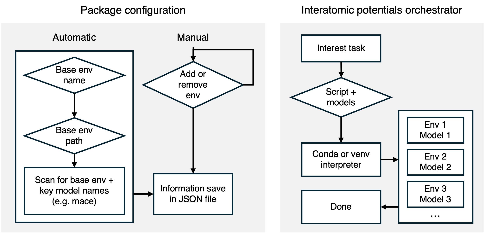

# Summary

Density Functional Theory (DFT) is a fundamental tool of computational materials science, providing quantum-mechanical accuracy for predicting structural, electronic, and thermodynamic properties at the atomic scale. However, its computational cost—scaling with the number of electrons—limits its applicability to relatively small systems and short timescales, restricting its use in simulations of complex materials, interfaces, and dynamical processes.

Machine Learning Interatomic Potentials (MLIPs) have emerged as a powerful alternative, enabling near ab initio accuracy at a fraction of the computational cost by learning the potential energy surface from DFT reference data [@kozinsky_2022]. By scaling with the number of atoms rather than electrons, MLIPs allow simulations of larger systems, longer timescales, and more diverse structural environments `[@focassio_2024]`. This has expanded the scope of atomistic modeling to problems such as phase transformations, defect dynamics, and biomolecule–material interactions.

However, the rapid growth of MLIP models - spanning different architectures, training datasets, and software ecosystems - has created a fragmented landscape, where models are often tied to incompatible dependencies and heterogeneous interfaces. This makes reproducible benchmarking and systematic comparison across models difficult in practice. IP-Orch addresses this challenge by providing a lightweight orchestration layer that enables consistent execution of multiple MLIPs across isolated environments, facilitating transparent and reproducible side-by-side evaluation within a unified ASE-based workflow.

# Statement of need

`IP-Orch` is a Python package for orchestrating the usage of multiple Machine Learning Interatomic Potentials. With the growth of multiple models, different architectures (e.g., equivariant Graph Neural Networks, message passing, transformers) and datasets (e.g., Materials Project, OC20, custom trajectories) have been used for training. As a result, this scenario led to incompatible environments (PyTorch/JAX/CUDA) and inconsistent APIs, making side‑by‑side evaluation cumbersome and error‑prone. `IP‑Orch` addresses this gap with a thin, ASE‑centric orchestration layer that standardizes execution across models.

By configuring the package in a default environment with its respective interpreter (Venv or Conda), it searches for common keywords of the current MLIPs that have already been released in Matbench Discovery [ref]. `IP-Orch` has already been used for the development of different internal benchmarks, both with API retrieval and local dataset, and can now be used as a lightweight alternative to orchestrate multiple models by different communities interested in working with Machine Learning Interatomic Potentials.

# State of the field

Some projects have recently been created to address the decentralization of these packages, such as Janus-Core and Rootstock, each adopting distinct approaches. janus-core provides closed pipelines within a single Python environment, installing MLIPs as “extras” - which can simplify usage, but tightly couple dependencies and may lead to conflicts between models, versions, and additional packages. In contrast, Rootstock is HPC-oriented, with pre-configured environments maintained by developers and isolated execution via subprocess/socket (i-PI), including integration with LAMMPS; however, this requires centralized setup and introduces a small IPC overhead.

IP-Orch focuses on a complementary advantage: orchestrating the same user ASE script across multiple environments and models, locally and without IPC/server layers, maintaining minimal overhead and transparent failure handling. Rather than prescribing workflows, it registers (env, model) pairs, provides interactive discovery, and enables explicit selection through flags such as `--envs` and `--models`, executing each combination “in-process” in the target environment. This design avoids dependency conflicts by construction, preserves the scientific logic within the user’s script, and facilitates reproducible benchmarking across MLIPs and environments. Thus, IP-Orch complements solutions like janus-core (closed pipelines within a single stack) and Rootstock (strong isolation and LAMMPS integration in HPC), prioritizing a local-first, portable approach with frictionless side-by-side comparisons.

# Software design

IP-Orch is designed to run the same user-defined ASE script across multiple models and environments in a simple and reproducible way. It follows three principles: (1) orchestrate rather than prescribe workflows; (2) rely on established tools such as the Atomic Simulation Environment (ASE) [@ase-paper]` while remaining environment-agnostic; and (3) minimize overhead by executing directly inside each target environment, without additional servers or communication layers.

This is implemented through a lightweight and modular architecture, as shown in Figure \label{fig:arch}. A central ModelFactory creates ASE calculators from simple aliases, while the CLI handles environment discovery, model selection, and execution. During runtime, IP-Orch iterates over selected (environment, model) pairs and runs the user script inside each environment using conda run, ensuring isolation and avoiding dependency conflicts. By delegating performance to the underlying MLIPs, IP-Orch focuses on providing a transparent and low-friction framework for reproducible benchmarking and comparison across models.

<!-- # Research impact statement

`Gala` has demonstrated significant research impact and grown both its user base and contributor community since its initial release. The package has evolved through contributions from over 18 developers beyond the original core developer (@adrn), with community members adding new features, reporting bugs, and suggesting new features.

While `Gala` started as a tool primarily to support the core developer's research, it has expanded organically to support a range of applications across domains in astrophysics related to Milky Way and galactic dynamics. The package has been used in over 400 publications (according to Google Scholar) spanning topics in galactic dynamics such as modeling stellar streams [@Pearson:2017], Milky Way mass modeling, and interpreting kinematic and stellar population trends in the Galaxy. `Gala` is integrated within the Astropy ecosystem as an affiliated package and has built functionality that extends the widely-used `astropy.units` and `astropy.coordinates` subpackages. `Gala`'s impact extends beyond citations in research: Because of its focus on usability and user interface design, `Gala` has also been incorporated into graduate-level galactic dynamics curricula at multiple institutions.

`Gala` has been downloaded over 100,000 times from PyPI and conda-forge yearly (or ~2,000 downloads per week) over the past few years, demonstrating a broad and active user community. Users span career stages from graduate students to faculty and other established researchers and represent institutions around the world. This broad adoption and active participation validate `Gala`'s role as core community infrastructure for galactic dynamics research.

# Citations

Citations to entries in paper.bib should be in
[rMarkdown](http://rmarkdown.rstudio.com/authoring_bibliographies_and_citations.html)
format.

If you want to cite a software repository URL (e.g. something on GitHub without a preferred
citation) then you can do it with the example BibTeX entry below for @fidgit.

For a quick reference, the following citation commands can be used:
- `@author:2001`  ->  "Author et al. (2001)"
- `[@author:2001]` -> "(Author et al., 2001)"
- `[@author1:2001; @author2:2001]` -> "(Author1 et al., 2001; Author2 et al., 2002)"

# Figures

Figures can be included like this:

and referenced from text using \autoref{fig:example}.

Figure sizes can be customized by adding an optional second parameter:
{ width=20% }

# AI usage disclosure

No generative AI tools were used in the development of this software, the writing
of this manuscript, or the preparation of supporting materials.

# Acknowledgements

We acknowledge contributions from Brigitta Sipocz, Syrtis Major, and Semyeong
Oh, and support from Kathryn Johnston during the genesis of this project.

# References -->
